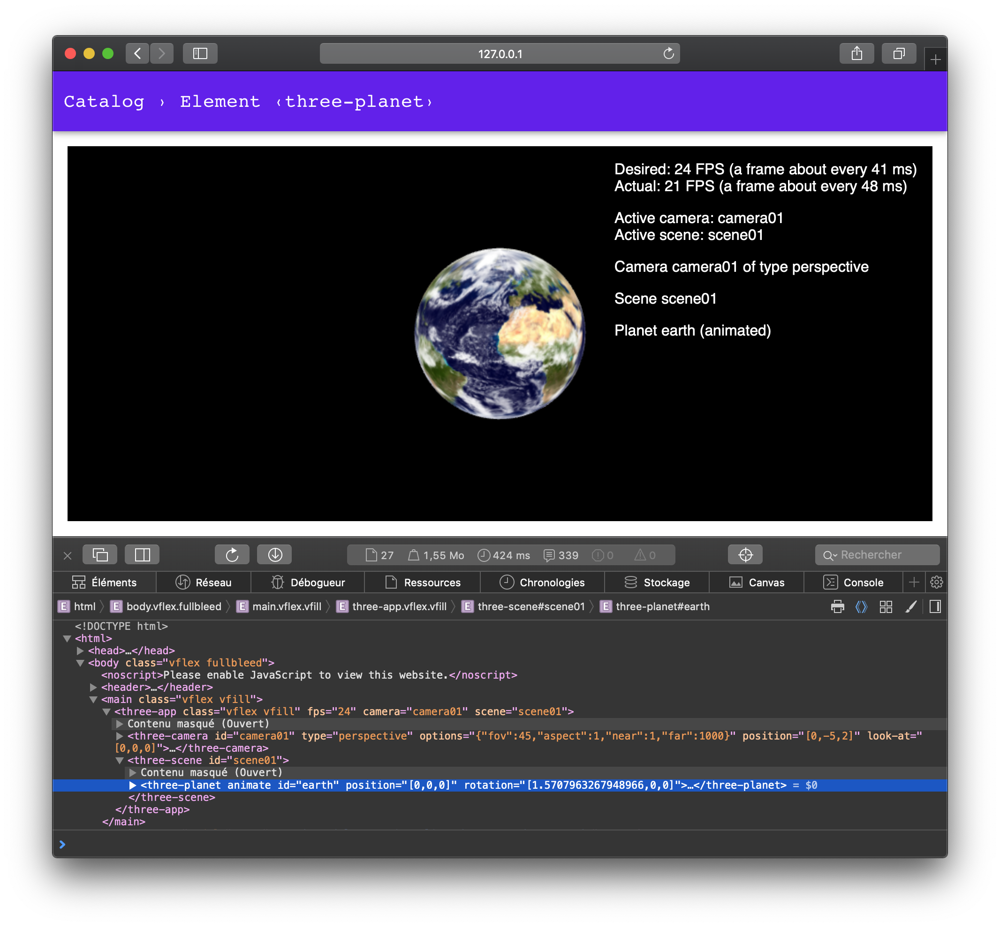

# Three Web Components

[](https://lernajs.io/) [](https://www.npmjs.com/package/@petitatelier/three-app)

A collection of Web Components to compose Three.js web apps, as simply as dropping them in the DOM and defining their attributes.

Based on [Lit-Element](https://lit-element.polymer-project.org), which allows you to generate a hierarchy of `<three-*>` elements and update their attribute values, driven by and bound to, data structures.

## Status

Alpha, early stages of design and implementation. Ideas and contributions appreciated and welcomed. Open an issue or submit a PR, if you'd like to participate.

## Usage

Install the packages of the web components you want; they are packaged separately:

```
$ npm install @petitatelier/three-app @petitatelier/three-camera ¬
              @petitatelier/three-scene @petitatelier/three-planet
```

The `<three-*>` web components can be used as follow (see also [demos/three-planet.html](demos/three-planet.html)):

```html
<three-app fps="24" camera="c01" scene="s01">
  <three-camera id="c01" type="perspective"></three-camera>
  <three-scene id="s01">
    <three-planet id="earth" animate></three-planet>
  </three-scene>
</three-app>
```

<a href="demos/assets/screenshots/20190222-three-planet-animated.png">
  </a>

## Contributing

This project uses [Lerna](https://lernajs.io) to manage the packages of this mono-repository. You can execute `npx lerna …` to run any Lerna command on the packages.

Lerna basically executes your command on each package of the repository. We commonly use the the following commands, wrapped as NPM scripts for convenience.

### Clone

    $ git clone git@github.com:petitatelier/three-web-components.git
    $ cd three-web-components

### Setup

Run at first, and for every new package:

    $ npm run bootstrap

### Run the dev server & code

Start the local _HTTP dev server_ and visit http://localhost:8081/demos/:

    $ npm run dev

Alternatively, to start a mini _OSC relay server_ at same time — to orbit a camera from a remote OSC controller:

    $ npm run dev:osc

### Publish to NPM

    $ npm run publish

### Design

See model in [design intentions](DESIGN.md), it shows some of the initial ideas.

When creating an app, you would generally create one of more new Web Components, based on the [`ThreeObject`](packages/three-object/three-object.js) class — which itself inherits from `LitElement` — and add it to a scene. See the [packages/three-planet](packages/three-planet/three-planet.js) package for an example.
