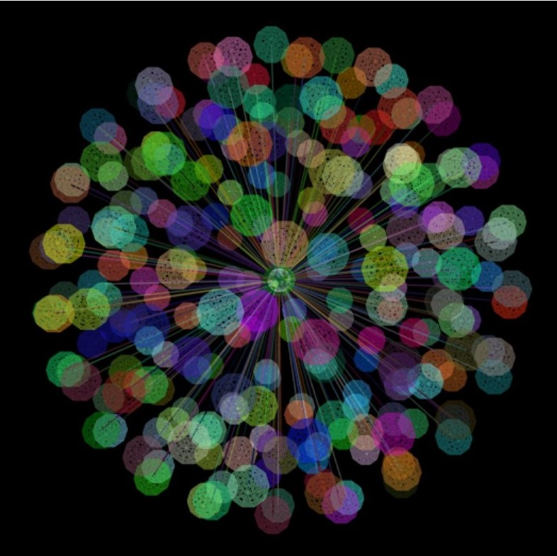
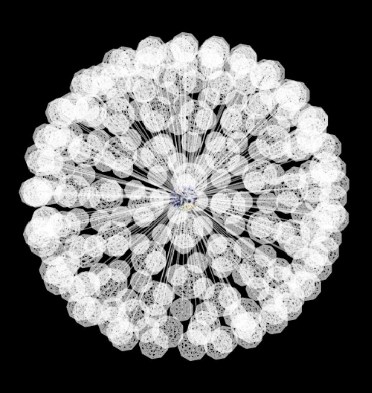
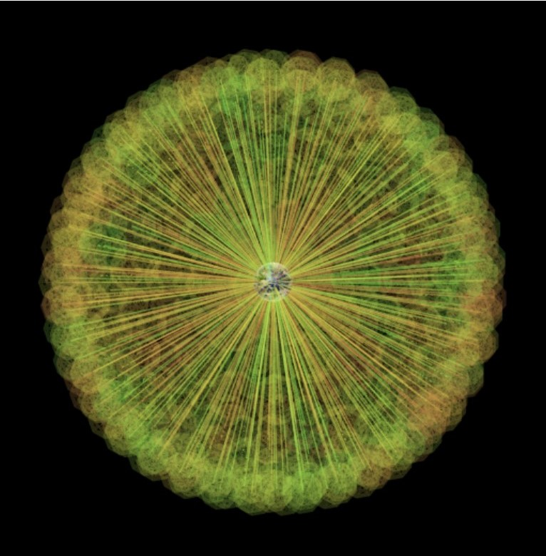

# ‹three-force-graph› class

Creates a force 3D graph element, that can be placed in a scene. 

## Features

TODO

## Screenshots

### Basic three force graph 
201 generated nodes with random colors

### Transparent white
301 generated nodes with a white transparent color

### Radioactive colors
501 generated nodes with a range of color

